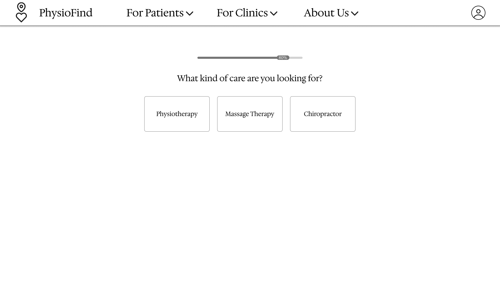
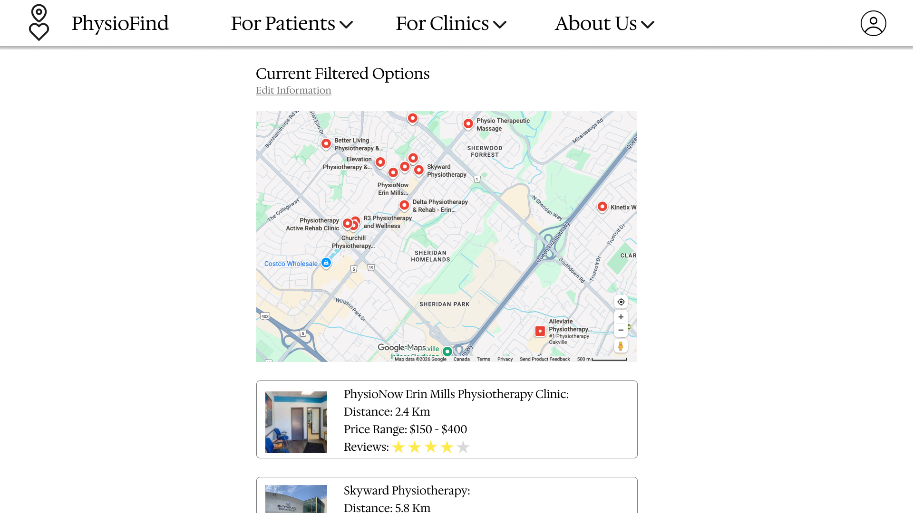

# User Experience

PhysioFind is a tool designed to make finding the medical help you need from non-provincially regulated clinics simple through an easy-to-use and streamlined user experience. 

### For Patients

Patients who have never used the service before will be prompted to fill out a simple questionnaire so that PhysioFind supplies them with the best results. This includes questions such as what the patient's price range is, what their availability is like, and what the maximum distance they are willing to travel is. Following the questionnaire, patients will be prompted to optionally make an account so they can access their results in the future.

For returning patients who have created an account, they have the option of returning to past results or searching for a new clinic based on different parameters by filling out the questionnaire again. Past results will not be overwritten when filling out a new questionnaire and can be found in the patient’s account menu.

Once the patient has completed the questionnaire, a new page will be displayed showing them a map of all their possible options. Below the map will be a list of clinics and some general information about them, such as their estimated cost and user score. When the patient finds one they are satisfied with, they can click on it to be shown additional information or to book an appointment with the clinic directly from PhysioFind.

If the patient is not satisfied with the results they receive, they can go back to the questionnaire and edit it as needed.

### For Clinics

Clinics can sign up for PhysioFind as a business account which will allow them to edit the information PhysioFind will supply to patients, such as images or descriptions. Clinics will not be able to disable or alter information such as the ratings they receive on PhysioFind or other review platforms to make sure patients are not given misinformation when attempting to decide which clinic to choose.

Clinics that are found in the area by PhysioFind that have not set up a business account will be filled out with as accurate of information as possible. Patients will be made aware that the results are automatically generated or that they are generated by the clinics.

Clinics or their medical professionals can add their availability on PhysioFind so that patients whose preferences fall within that time frame are more likely to see those results. If a clinic gets a booking through PhysioFind, they will receive a confirmation notification detailing all the required information about the patient and their upcoming appointment.

## User Interface Graphic Representations

### Patient Questionnaire

### Results Page

