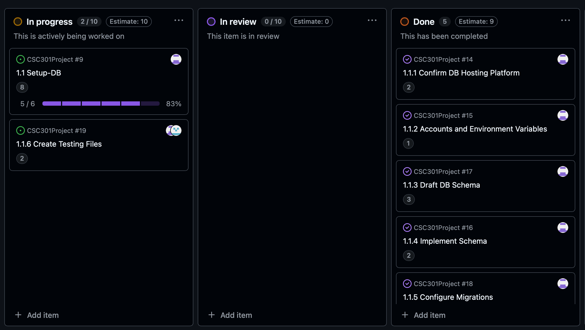
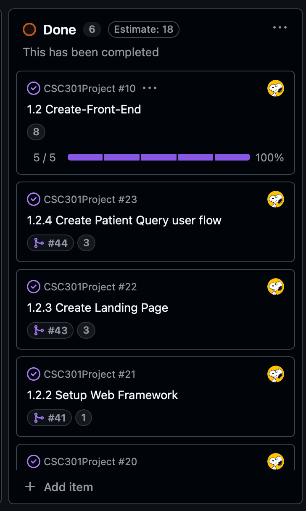
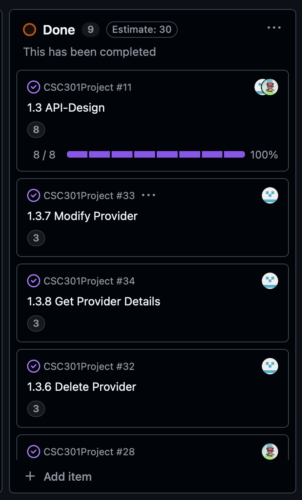
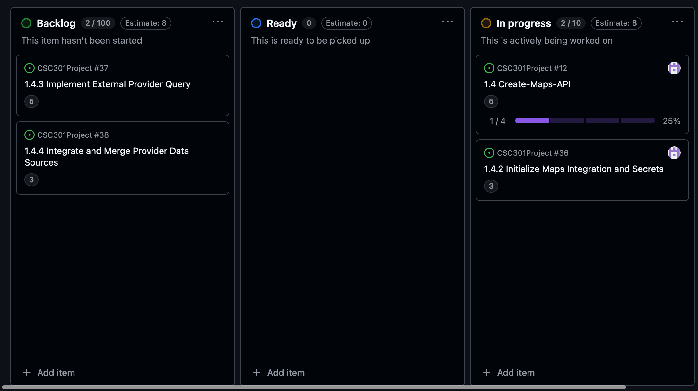
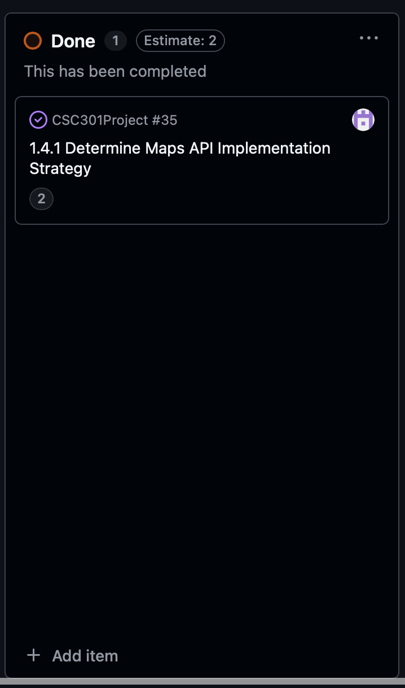

# Sprint Completion

## User Story 1.1:
**Estimate:** 8\
As a developer, I want to set up a Postgres database schema for users and clinics so that we have a foundation for storing and retrieving data later.

**1.1.1: Confirm DB Hosting Platform**\
**Description:** Research database hosting options to compare against Supabase so the group can make an informed decision on the final platform.\
**Estimate:** 2

**1.1.2: Accounts and Environment Variables**\
**Description:** Set up the shared platform account and configure environment variables to secure credentials for both local and hosted testing.\
**Estimate:** 1

**1.1.3: Draft DB Schema**\
**Description:** Design the database tables for users and service providers by identifying the necessary attributes and data types for each entity.\
**Estimate:** 3
    
**1.1.4: Implement Schema**\
**Description:** Determine whether to use an Object-Relational Mapper or raw SQL and implement the final schema accordingly.\
**Estimate:** 2

**1.1.5: Configure Migrations**\
**Description:** Set up and verify that database schema migrations run correctly across local, testing, and cloud environments.\
**Estimate:** 1

## User Story 1.2:
**Estimate:** 8\
As a developer, I want to set up our React frontend development environment so that we can begin implementing UI features.

**1.2.1: Confirm Web Framework**\
**Description:** Research and present front-end web framework options that meet project requirements so the team can select the best one.\
**Estimate:** 1

**1.2.2: Framework Setup**\
**Description:** Initialize the chosen web framework by configuring the base project structure and standardizing code quality tools.\
**Estimate:** 1

**1.2.3: Create Landing Page**\
**Description:** Implement the basic layout for the landing page including navigation, hero section, and footer using placeholder assets to establish the rough styling.\
**Estimate:** 3

**1.2.4: Create User Flow**\
**Description:** Develop the user interface and logic for the question-and-answer flow using placeholder data, without requiring backend API integration yet.\
**Estimate:** 3

**1.2.5: Create Search Results Flow**\
**Description:** Build the search results page layout to display verified clinics and Google Maps entries using placeholder data to visualize the final design.\
**Estimate:** 2

## User Story 1.3:
**Estimate:** 8\
As a developer, I want to define basic API endpoints for providers and booking so that frontend and backend communication is clear.

**1.3.1: Implement User Creation**\
**Description:** Implement the API endpoint to create new user records with all required personal fields and system-generated metadata.\
**Estimate:** 3

**1.3.2: Delete User**\
**Description:** Implement an API endpoint that supports both soft deletion (marking the record as deleted) and hard deletion (permanently removing the record from the database).\
**Estimate:** 2

**1.3.3: Modify User**\
**Description:** Create API endpoints to handle user profile updates, such as changing location or updating passwords, to accommodate various modification scenarios.\
**Estimate:** 2

**1.3.4: Get User**\
**Description:** Develop an endpoint to retrieve user data for the frontend, ensuring strictly limited data exposure due to the presence of sensitive PII and medical information.\
**Estimate:** 3
    
**1.3.5: Create Provider Entity**\
**Description:** Implement the functionality to create a provider profile, capturing all necessary business details, account credentials, and descriptive attributes such as specialties and operating hours.\
**Estimate:** 3

**1.3.6: Delete Provider**\
**Description:** Implement an API endpoint to remove provider accounts, supporting both soft deletion for data retention and hard deletion for permanent removal.\
**Estimate:** 3

**1.3.7: Modify Provider**\
**Description:** Create endpoints to allow providers to update their profile information, including account credentials, business descriptions, and operational details like opening hours and staff count.\
**Estimate:** 3

**1.3.8: Get Provider Details**\
**Description:** Develop endpoints to retrieve provider information, ensuring strict security controls for account details while allowing easy access to public data like business name, location, and hours.\
**Estimate:** 3

## User Story 1.4:
**Estimate:** 5\
As a developer, I want to create a API that gets provider profiles based on the location given so that patient-facing features can be used and tested.

**1.4.1: Determine Maps API Implementation Strategy**\
**Description:** Evaluate the security and performance implications to decide whether Google Maps API requests should be handled directly on the front end or proxied through the back end.\
**Estimate:** 2

## Complete User Stories in Tracking Table:

## User Story 1.1:

## User Story 1.2

## User Story 1.3

## User Story 1.4

