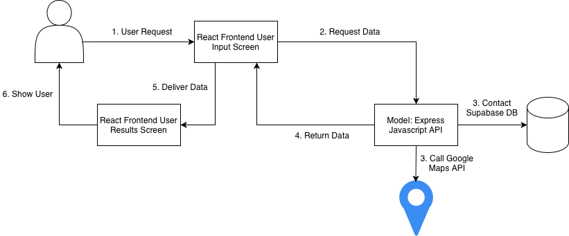

# System Design

**Collaborators:** Parth Jain, Drew Nerbas, Martin Stric, Jordan Jones, Saahil Pandit

## Table of Contents

- [System Design](#system-design)
  - [Table of Contents](#table-of-contents)
  - [1. Introduction](#1-introduction)
    - [1.1. Purpose](#11-purpose)
  - [2. CRC Cards](#2-crc-cards)
    - [2.1. Database Models](#21-database-models)
    - [2.2. Backend Layer](#22-backend-layer)
    - [2.3. Frontend Layer](#23-frontend-layer)
  - [3. Software Architecture](#3-software-architecture)
    - [3.1. Architecture Overview](#31-architecture-overview)
    - [3.2. Technology Stack](#32-technology-stack)
    - [3.3. Architecture Diagram](#33-architecture-diagram)
    - [3.4. Data Flow](#34-data-flow)
    - [3.5. Design Rationale](#35-design-rationale)
  - [4. Conclusion](#4-conclusion)

## 1. Introduction

PhysioFind is a web application designed to connect patients in Ontario with allied health professionals, such as physiotherapists, chiropractors, and registered massage therapists. The platform aims to streamline the process of discovering and booking appointments with healthcare providers by offering a user-friendly interface and a robust backend system.

### 1.1. Purpose

The purpose of this document is to outline the software architecture and design principles of PhysioFind. It provides an overview of the system's structure, technology stack, and data flow, serving as a guide for developers and stakeholders involved in the project.

## 2. CRC Cards

### 2.1. Database Models

|**Class:** `clinics`|
|:-|
|**_Responsibilities_**|
|• Store clinic information (name, contact details, website)|
|• Store clinic address (address lines, city, province, postal code)|
|• Store geographic coordinates (latitude, longitude)|
|• Store online booking information (booking provider, booking URL)|
|**_Collaborators_**|
|• `PrismaClient`|
|• `users`|

|**Class:** `users`|
|:-|
|**_Responsibilities_**|
|• Store user authentication data (email, password hash)|
|• Store user profile information (first name, last name, phone number, date of birth)|
|• Define system-level role (patient/admin/staff)|
|• Associate user with a clinic (clinic ID)|
|• Define role within clinic (clinic role – e.g., doctor, nurse, receptionist)|
|**_Collaborators_**|
|• `PrismaClient`|
|• `clinics`|

### 2.2. Backend Layer

|**Class:** `PrismaClient`|
|:-|
|**_Responsibilities_**|
|• Execute type-safe database queries|
|• Manage database connections to Supabase PostgreSQL|
|• Handle UUID generation and timestamps|
|• Auto-generate TypeScript types from schema|
|**_Collaborators_**|
|• `clinics`|
|• `users`|

|**Class:** `ClinicService`|
|:-|
|**_Responsibilities_**|
|• Perform CRUD operations on clinic data|
|• Search clinics by location (city, province, postal code)|
|• Find nearby clinics using latitude/longitude|
|• Validate clinic data|
|**_Collaborators_**|
|• `PrismaClient`|
|• `clinics`|
|• `ClinicController`|

|**Class:** `UserService`|
|:-|
|**_Responsibilities_**|
|• Perform CRUD operations on user data|
|• Update user profiles|
|• Query users by email, role, or clinic|
|• Associate users with clinics|
|**_Collaborators_**|
|• `PrismaClient`|
|• `users`|
|• `clinics`|
|• `UserController`|
|• `AuthService`|

|**Class:** `AuthService`|
|:-|
|**_Responsibilities_**|
|• Handle user registration and login|
|• Hash and verify passwords|
|• Generate and validate JWT tokens|
|• Manage user sessions|
|**_Collaborators_**|
|• `PrismaClient`|
|• `users`|
|• `UserService`|
|• `AuthController`|

|**Class:** `ClinicController`|
|:-|
|**_Responsibilities_**|
|• Handle `/api/clinics` routes|
|• `GET /api/clinics` - Retrieve list of clinics|
|• `GET /api/clinics/:id` - Get clinic details|
|• `POST /api/clinics` - Create new clinic (admin)|
|• `PUT /api/clinics/:id` - Update clinic information (admin)|
|**_Collaborators_**|
|• `ClinicService`|
|• Express Router|
|• AuthMiddleware|

|**Class:** `UserController`|
|:-|
|**_Responsibilities_**|
|• Handle `/api/users` routes|
|• `GET /api/users/:id` - Retrieve user profile|
|• `PUT /api/users/:id` - Update user profile|
|• `PUT /api/users/:id/clinic` - Assign to clinic|
|**_Collaborators_**|
|• `UserService`|
|• Express Router|
|• AuthMiddleware|

|**Class:** `AuthController`|
|:-|
|**_Responsibilities_**|
|• Handle `/api/auth` routes|
|• `POST /api/auth/register` - User registration|
|• `POST /api/auth/login` - User login|
|• `POST /api/auth/logout` - User logout|
|• `GET /api/auth/me` - Get current user|
|**_Collaborators_**|
|• `AuthService`|
|• `UserService`|
|• Express Router|

|**Class:** `AuthMiddleware`|
|:-|
|**_Responsibilities_**|
|• Verify JWT tokens on protected routes|
|• Attach user info to request object|
|• Return 401 for invalid tokens|
|**_Collaborators_**|
|• Express Router|
|• All protected controllers|

### 2.3. Frontend Layer

|**Class:** `App`|
|:-|
|**_Responsibilities_**|
|• Initialize React application|
|• Set up routing using React Router|
|• Provide global auth state management|
|• Render main layout components (header, footer, navigation)|
|**_Collaborators_**|
|• React Router|
|• `AuthContext`|
|• All pages|

|**Class:** `APIClient`|
|:-|
|**_Responsibilities_**|
|• Handle HTTP requests to backend API|
|• Provide typed methods for API endpoints|
|• Attach JWT token to requests|
|• Handle response parsing and error handling|
|**_Collaborators_**|
|• Fetch API|
|• All React components|
|• Backend controllers|

|**Class:** `AuthContext`|
|:-|
|**_Responsibilities_**|
|• Store current user and JWT token|
|• Provide login, logout, and registration methods|
|• Share auth state across components|
|• Persist auth across sessions (localStorage)|
|**_Collaborators_**|
|• `APIClient`|
|• Login page|
|• `App`|
|• All protected components|

## 3. Software Architecture

### 3.1. Architecture Overview

PhysioFind follows the Model-View-Controller (MVC) architectural pattern, a widely-used design pattern in web applications. The system is structured in three tiers:

1. **Presentation Tier (View):** React-based frontend that handles user interface and user interactions.
2. **Application Tier (Controller):** Express.js backend API that processes requests, implements business logic, and coordinates between the view and model.
3. **Data Tier (Model):**PostgreSQL database that persists application data and manages data relationships.

### 3.2. Technology Stack

**Frontend (View):**
- React 19.2 - UI component framework
- React Router 7.13 - Client-side routing
- TypeScript 5.9 - Best language ever
- Vite - Build tool and development server

**Backend (Controller):**
- Node.js - Runtime environment
- Express.js 5.2 - Web application framework

**Database (Model):**
- PostgreSQL - Relational database management system

### 3.3. Architecture Diagram

The following diagram illustrates the MVC architecture of PhysioFind, showing the flow of data and interactions between the different layers:

### 3.4. Data Flow

A typical request flow through the system follows these steps:
1. The user interacts with the React frontend, triggering an event (e.g., form submission).
2. The frontend sends an HTTP request to the Express.js backend API.
3. The backend processes the request, applies business logic, and interacts with the PostgreSQL database as needed.
4. The database returns the requested data to the backend.
5. The backend forwards the response to the frontend.
6. The frontend updates the user interface based on the response.

### 3.5. Design Rationale

The MVC architecture was chosen for its clear separation of concerns, which enhances maintainability and scalability. React provides a dynamic and responsive user interface, while Express.js offers a robust framework for building RESTful APIs. PostgreSQL was selected for its reliability and support for complex queries, which are essential for managing the relationships between users, physiotherapists, and appointments.

## 4. Conclusion

This system design document outlines the architecture and technology stack of PhysioFind, providing a foundation for the development and maintenance of the application. The MVC pattern ensures a modular structure, facilitating future enhancements and scalability.

As development progresses, this design will serve as a living foundation for implementing features; further refinements to the architecture may be made to address emerging requirements and optimize performance.
