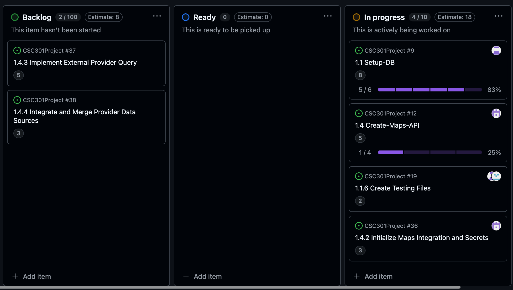
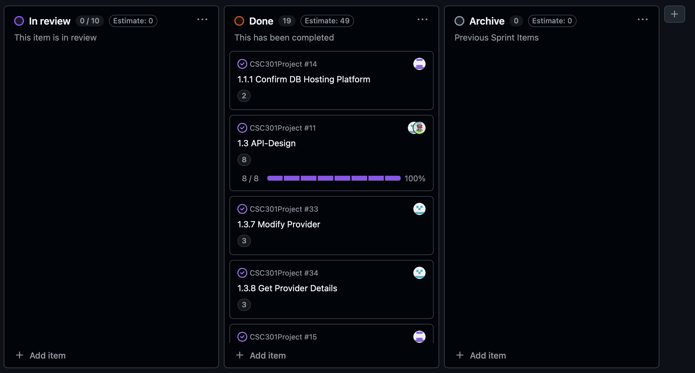
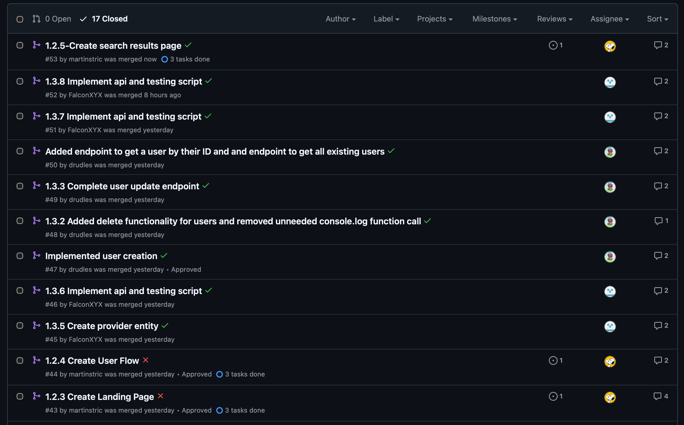
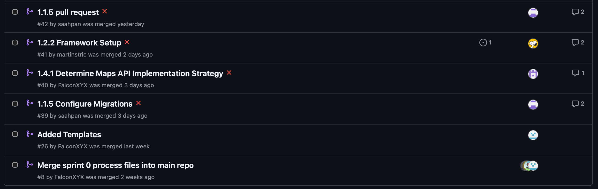
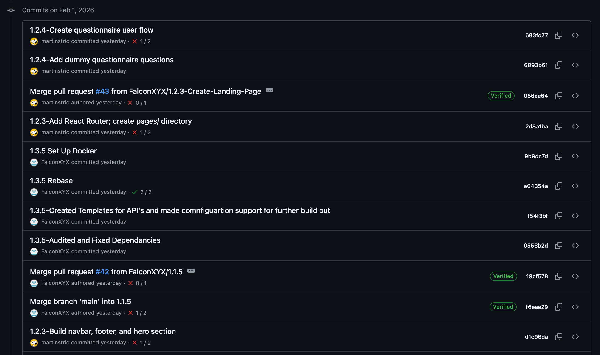
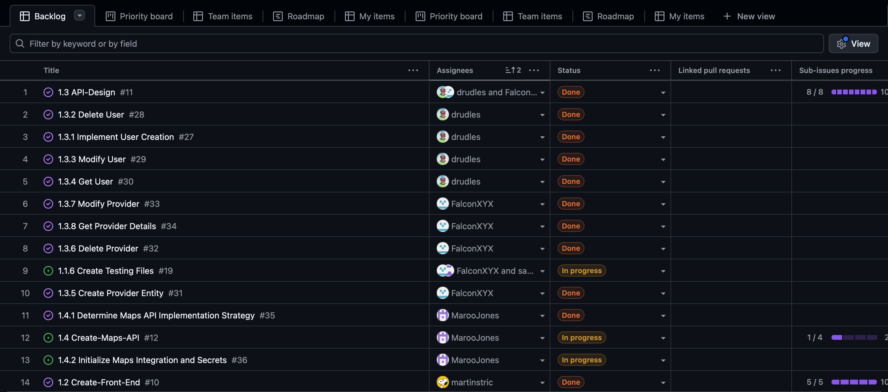
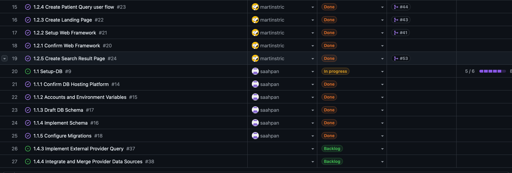
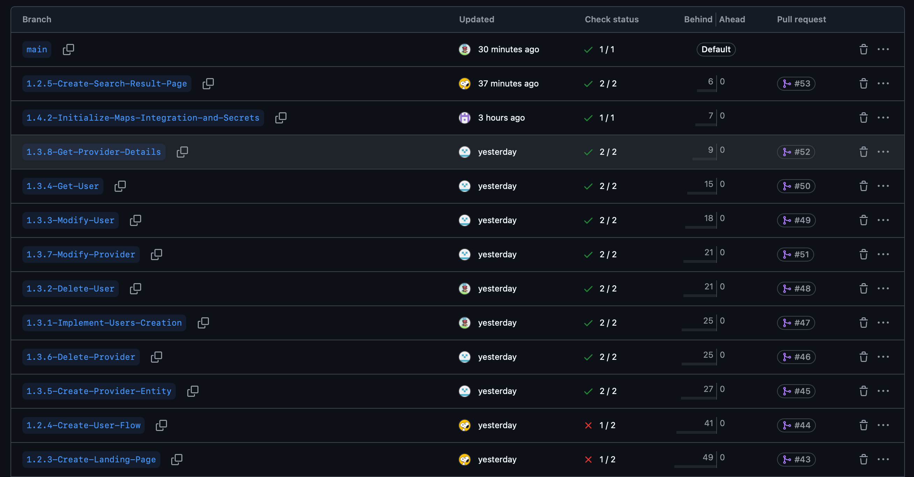
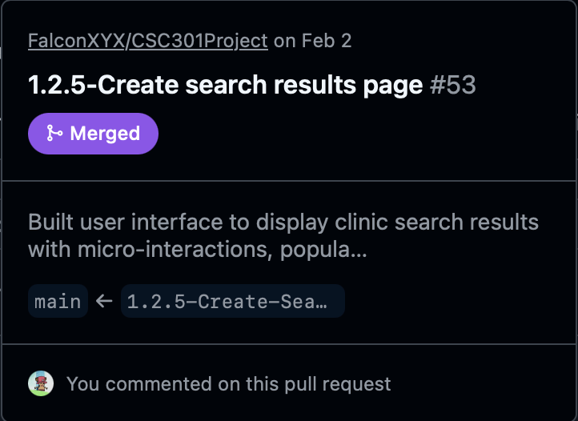
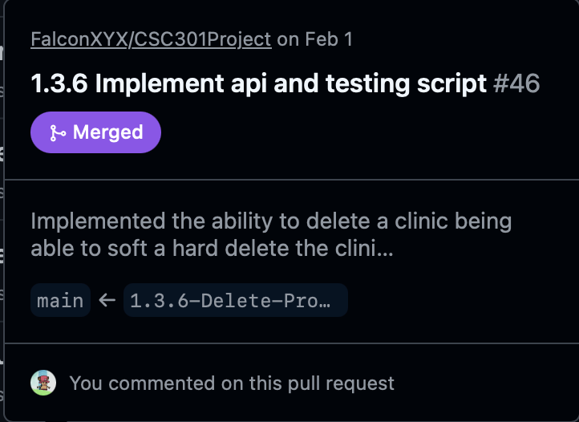

# Tracking

Everything found in this document can be seen and fact checked by accessing our GitHub repository found at https://github.com/FalconXYX/CSC301Project.git. The sprint board can be found under the projects tab in the project titled "CSC301 Physiofind Project Tracking".

## Sprint Board:

\
The above two screenshots show our sprint board in its current state at the end of the sprint. Any user stories that cannot be seen in the screenshots will be found in the "Done" section (To see the sprint board, click here: https://github.com/users/FalconXYX/projects/1).
## Stories Started

As seen in the images above, all major user stories were started during this sprint. The reason parts of user story 1.4, which included tasks 1.4.2 through 1.4.4, were not completed is that the person in charge had a family emergency. These tasks were not picked up by others team members because they were deemed a lower priority; fully integrating them would require features scheduled for implementation in future sprints.

## Pull Requests:

\
The above 2 images showcase all of the complete pull requests that can be found on our GitHub project (Click here to view our closed pull requests: https://github.com/FalconXYX/CSC301Project/pulls?q=is%3Apr+is%3Aclosed).
As you can see when comparing these two images with the sprint board found above, all the assignees for the pull requests are the same as those assigned to the user stories on the sprint board (See link above to view sprint board). 

## Commits and Commit Messages:

\
The image above shows examples of the commit messages used by our group. All of our commit messages can be viewed by clicking on this link: https://github.com/FalconXYX/CSC301Project/commits/main?before=ba533ea5f63e15b0bff2dfb96ca14118349ddc97+35

## Task Distribution

\
The two screenshort above showcase every task that has been complete or is still in progress as well as who is assigned to said task, showing the distribution. This can be found under the same link to get to the sprint board. Once you have made it to the sprint board, if you click the button labeled "View" and click "Table", you will see the page imaged above.

## Branch Names:

The image above shows some of the branches and their names (All branches can be seen here: https://github.com/FalconXYX/CSC301Project/branches/all). The image also shows if the branch has had a pull request associated with it.

\
The two images above give 2 pull requests as an example that all pull requests were made from a different branch. To see all pull requests and which branch it came from, use the link found in the pull requests section.