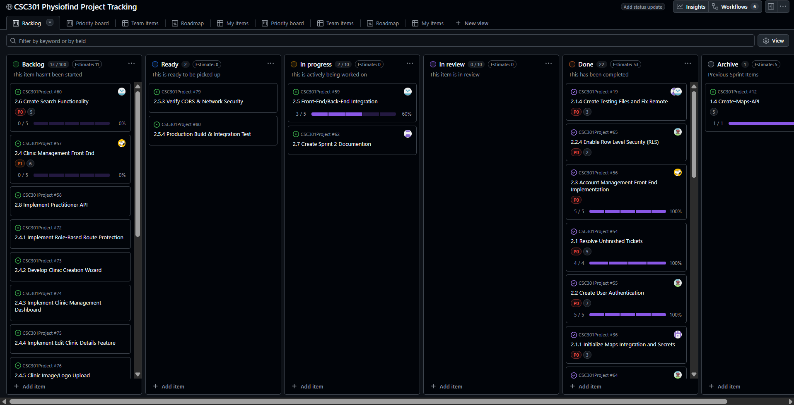

# Sprint 2 Completion Report

Analysis of work completed based on the GitHub Project tracking estimates.

## 1. Completed Tasks (Done column)

| ID | Title | Points | Status |
|---|---|---|---|
| **2.0.1** | Switch from React to Vue | — | Completed |
| **1.1** | Setup-DB | 8 | Completed |
| **2.1** | Resolve Unfinished Tickets | 5 | Completed |
| **2.1.1** | Initialize Maps Integration and Secrets | 3 | Completed |
| **2.1.2** | Implement External Provider Query | 5 | Completed |
| **2.1.3** | Integrate and Merge Provider Data Sources | 3 | Completed |
| **2.1.4** | Create Testing Files and Fix Remote | 3 | Completed |
| **2.2** | Create User Authentication | 7 | Completed |
| **2.2.1** | Configure Supabase Auth Providers | 3 | Completed |
| **2.2.2** | Create Backend Auth Middleware | 5 | Completed |
| **2.2.3** | Apply Auth Middleware to API Endpoints | 3 | Completed |
| **2.2.4** | Enable Row Level Security (RLS) | 2 | Completed |
| **2.2.5** | Configure CORS (Cross-Origin Resource Sharing) | 3 | Completed |
| **2.3** | Account Management Front End Implementation | — | Completed |
| **2.3.1** | Implement Auth Context | 3 | Completed |
| **2.3.2** | Implement Sign-Up Page | — | Completed |
| **2.3.3** | Implement Login Page | — | Completed |
| **2.3.4** | Create Protected Route Wrapper | — | Completed |
| **2.3.5** | Implement User Profile & Settings UI | — | Completed |
| **2.5.1** | Configure Environment Variables | — | Completed |
| **2.5.2** | Implement Dynamic API Client | — | Completed |
| **2.5.5** | Troubleshoot Integration Issues | — | Completed |

## 2. Calculated Velocity

- **Total Items Completed:** 22
- **Points Completed:** 53 *(as shown on the board: Done Estimate: 53)*
- **Total Points Planned:** 106 *(as shown on the board: Backlog Estimate: 106)*
- **Completion Percentage:** **~50%**

> [!NOTE]  
> Our team completed 22 items totalling **53 story points** this sprint, focusing on high-priority (P0) infrastructure, authentication, and front-end setup tasks. The remaining planned work (In Progress and Backlog) is well-defined for the next phase.
