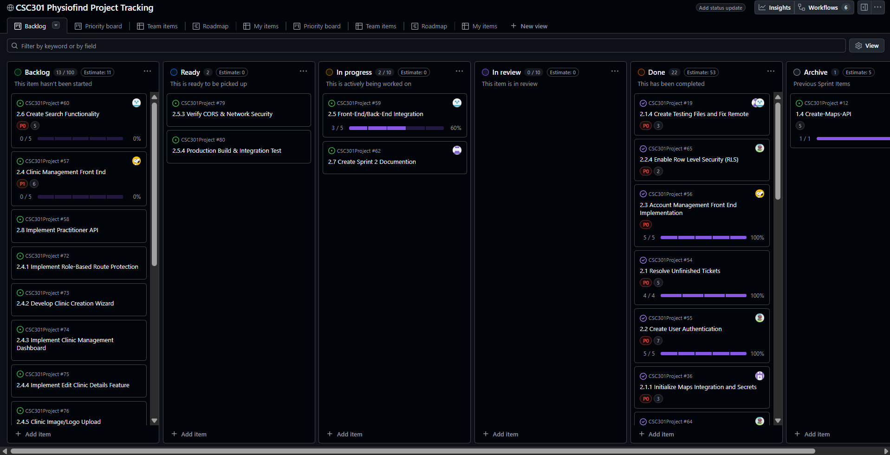
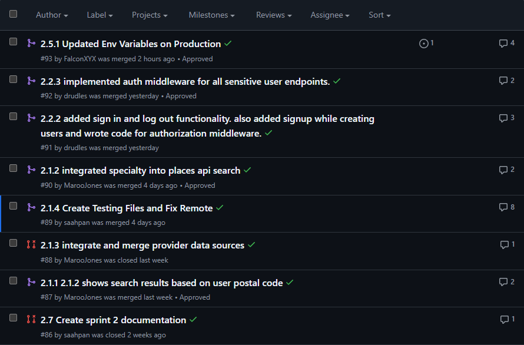
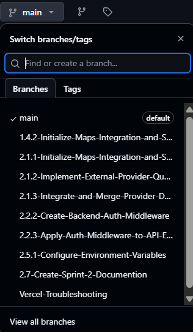

# Project Tracking

## 1. Active Sprint Board
**Question:** Are all your stories and tasks being worked in this sprint tracked on Active Sprint Board?  
**Answer:** Yes, all stories and tasks are being tracked on Active Sprint Board on GitHub project tracking tool. Refer to `CSC301-PhysioFind-Project-Tracking.png`.

## 2. Story Start Status
**Question:** Did you start all stories for sprint one?  
**Answer:** Most of stories have been started and each story has a logical explanation provided as a story comment.

## 3. Pull Request Alignment
**Question:** Do the pull request on GitHub match the tasks listed on Tracking Tool Active Sprint Board?  
**Answer:** Yes, refer to `Pull-Requests.png` and `CSC301-PhysioFind-Project-Tracking.png`.

## 4. Assignment Compliance
**Question:** Is the pull request done by the person to whom the task has been assigned to?  
**Answer:** Yes, refer to `Pull-Requests.png` and `CSC301-PhysioFind-Project-Tracking.png`.

## 5. Branching Strategy
**Question:** Is each pull request made from a separate branch for each individual task?  
**Answer:** Yes, refer to `Pull-Request-Example1.png` and `Branch-Naming.png`.

## 6. Commit Clarity
**Question:** Is the git commit message clear?  
**Answer:** Yes, it is clear and concise, refer to `Pull-Request-Example1.png`.

## 7. Tasks Distribution
Each team member has been assigned tasks and the tasks are distributed evenly among the team members. Refer to `CSC301-PhysioFind-Project-Tracking.png` and `Pull-Requests.png` to show completion.

## 8. Branch Naming
Every team branch is named after the associated single ticket number. Refer to `Branch-Naming.png`.
